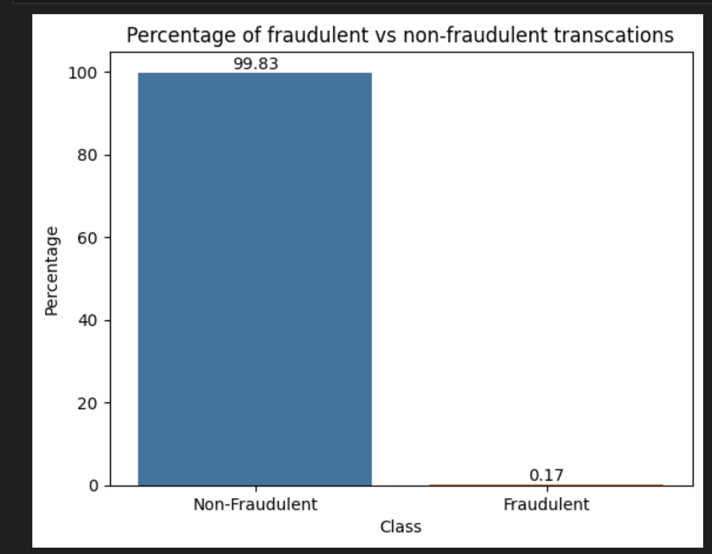
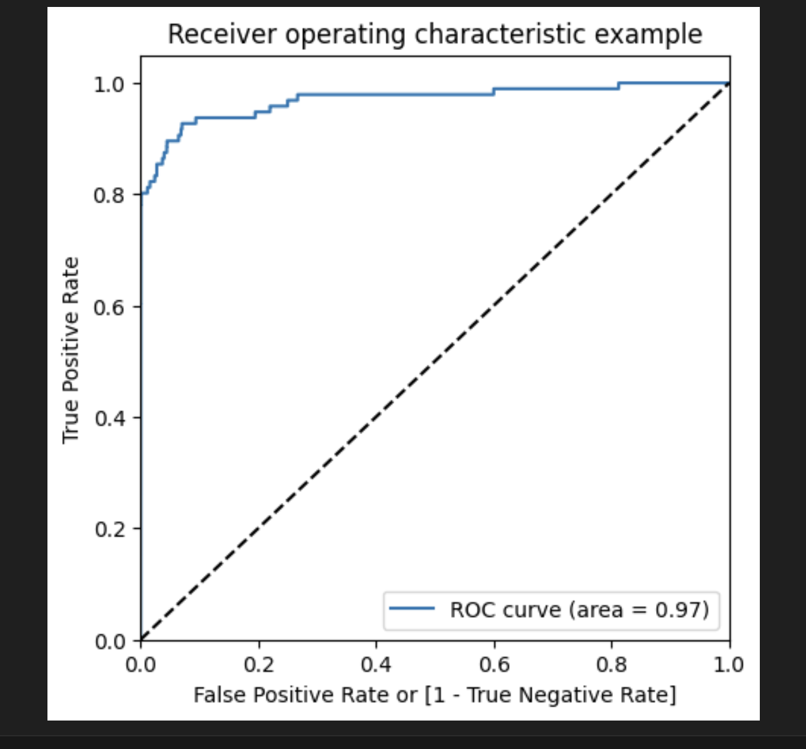

# AI-ML Bootcamp Capstone Project
## Project : FindDefault (Prediction of Credit Card fraud)

## Problem Statement:
A credit card is one of the most used financial products to make online purchases and
payments. Though the Credit cards can be a convenient way to manage your finances, they can
also be risky. Credit card fraud is the unauthorized use of someone else's credit card or credit
card information to make purchases or withdraw cash.
It is important that credit card companies are able to recognize fraudulent credit card
transactions so that customers are not charged for items that they did not purchase.
The dataset contains transactions made by credit cards in September 2013 by European
cardholders. This dataset presents transactions that occurred in two days, where we have 492
frauds out of 284,807 transactions. The dataset is highly unbalanced, the positive class (frauds)
account for 0.172% of all transactions.
We have to build a classification model to predict whether a transaction is fraudulent or not.

## System Architecture

### Following steps followed to solve this problem statement:

- Exploratory Data Analysis:
Analyze and understand the data to identify patterns,
relationships, and trends in the data by using Descriptive Statistics and Visualizations.

- Data Cleaning:
This might include standardization, handling the missing values and outliers in the data.

- Dealing with Imbalanced data:
This data set is highly imbalanced. The data should be
balanced using the appropriate methods before moving onto model building.

- Feature Engineering:
Create new features or transform the existing features for better performance of the ML Models.

- Model Selection:
Choose the most appropriate model that can be used for this project.

- Model Training:
Split the data into train & test sets and use the train set to estimate the best model parameters.

- Model Validation:
Evaluate the performance of the model on data that was not used during the training process. The goal is to estimate the model's ability to generalize to new, unseen data and to identify any issues with the model, such as overfitting.

- Model Deployment: (OPTIONAL)
Model deployment is the process of making a trained machinelearning model available for use in a production environment.

### Plot for Number of fraudulent vs non-fraudulent transcations

### Metric selection 
As per the above plot data is heavily imbalanced, where only 0.17% transctions are fraudulent, we should not consider Accuracy as a good measure for evaluating the model. Because in the case of all the datapoints return a particular class(1/0) irrespective of any prediction, still the model will result more than 99% Accuracy.

Hence, we have to measure the ROC-AUC score for fair evaluation of the model. The ROC curve is used to understand the strength of the model by evaluating the performance of the model at all the classification thresholds. The default threshold of 0.5 is not always the ideal threshold to find the best classification label of the test point. Because the ROC curve is measured at all thresholds, the best threshold would be one at which the TPR is high and FPR is low, i.e., misclassifications are low. After determining the optimal threshold, we can calculate the F1 score of the classifier to measure the precision and recall at the selected threshold.

#### Why SVM was not tried for model building and Random Forest was not tried for few cases?
In the dataset we have 284807 datapoints and in the case of Oversampling we would have even more number of datapoints. SVM is not very efficient with large number of datapoints beacuse it takes lot of computational power and resources to make the transformation. When we perform the cross validation with K-Fold for hyperparameter tuning, it takes lot of computational resources and it is very time consuming. Hence, because of the unavailablity of the required resources and time SVM was not tried.

For the same reason Random forest was also not tried for model building in few of the hyperparameter tuning for oversampling technique.

#### Why KNN was not used for model building?
KNN is not memory efficient. It becomes very slow as the number of datapoints increases as the model needs to store all the data points. It is computationally heavy because for a single datapoint the algorithm has to calculate the distance of all the datapoints and find the nearest neighbors.

#### Classification Report:

It is a performance evaluation metric in machine learning and it is used to show the
precision, recall, F1-score and supports the trained classification model.
It helps to provide a better understanding of the overall performance of the trained
model. To understand the classification report of the machine learning model, we
need to know the metrics as follows:

- Precision:
    *  It is defined as the ratio of true positive to the sum of true and false positive.
    *  It is given as, True positives / (True positives + False positives)
    * It tells how many of the correctly predicted cases actually turned out to be positive.

-  Recall:
    * It is defined as the ratio of the true positives to the sum of true positives and
false negative.
    * It is given as, True positives/ (True positives + False Negative.
    *  It tells us how many of the actual positive cases are able to predict correctly with the model    classification.
-  F1-score:
    * It is the harmonic mean of precision and recall.
    * It gives a combined idea of the two metrices and it will be maximum when the
precision is equal to recall. i.e., precision = recall .
 
- AUC – ROC:

    It is a curve which performs the measurement for the classification problem at
    various threshold settings where the term AUC stands for “Area Under the Curve”
    and ROC stands for “Receiver Operator Characteristics”.
    The Receiver Operator Characteristics (ROC) curve is an evaluation metric for
    binary classification problems and also it is a probability curve that plots the TPR
    against FPR at various threshold values where it essentially separates the signal
    from noise.
    The Area Under the Curve (AUC)is the measure of the ability of a classifier in order
    to distinguish between the classes and it is used as a summary for the ROC curve.
    It tells how the model is capable to distinguish between the classes. As AUC is
    higher, the performance of the model will be better due to which it is distinguished
    between the positive and negative classes at predicting 0 classes as 0 and 1 classes
    as 1.
    And the performance of the model has been speculated by the best model which has
    AUC which is near to 1 which means that it has a good measure of separation and
    the poor model has an AUC which is near to 0 which means that it has the worst
    measure of separation.
    It also reciprocates the result when it is predicted in 0 as 1 and 1 as 0 and when the
    AUC is 0.5, then the model has no class separation capacity.

### MODEL BUIDING
 The machine learning models used to solve the problem algorithm as follows:
 1. Logistic Regression
 2. Decision Tree classifier
 3. Random Forest classifier
 4. XG Boost classifier

#### Logistic Regression:
 It is one of the most popular machine learning algorithms which
comes under supervised learning technique and also it is used for predicting
the dependent variable using a given set of independent variables.

#### Decision tree classifier:
 It is a tree – structured classifier in which the internal nodes
represents the features of the dataset, the branches represents the decision
rules and the leaf node represents the outcome.
It is a supervised learning technique that is used for both classification and
regression problems but mostly it is mostly preferred for solving classification
problems

#### Random Forest Classifier:
 It is a machine learning technique which is used to solve
regression and classification problems and it also utilizes the ensemble
learning which is a technique that combines many classifiers to provide
solutions to the complex problems

#### XG Boost Classifier:
 It is an optimized distributed gradient boosting library designed
to be highly efficient, flexible and portable. It implements the machine learning
algorithms under the gradient boosting frameworks and it provides a parallel
tree boosting to solve many data science problems in an accurate way.

### Model Building with Balanced Class
 In order to balance the classes, the following methods have been
used as follows:

1.  Undersampling :-  for balancing the class distribution, the non-fraudulent transctions count will be reduced to 396 (similar count of fraudulent transctions).
2.   Oversampling :- Here we will make the same count of
non-fraudulent transctions as fraudulent transctions.
3. SMOTE :- Synthetic minority oversampling technique. It is
another oversampling technique, which uses nearest neighbor algorithm to create synthetic data.
4. Adasyn:- This is similar to SMOTE with minor changes that the new synthetic data is generated on the region of low density of imbalanced data points.
5. Hyperparameter tuning:
    It is a collection of individual records containing the important
    features in the machine learning problem
    It is used during trained data for configuring the model and it accurately make
    predictions of the similar data.

## Implementation:

 This dataset contains transactions made by European card holders over a period of two days 
 in September 2013 out of which the total transaction is 2,84,807 from which 492 were fraudulent.
 As this data is highly unbalanced, the positive class or known to be frauds accounted for 0.172% 
 of the total transactions.This dataset has been modified with Principal Component Analysis (PCA) 
 in order to maintain confidentiality. Apart from time and amount, all other features from v1 to v28 are the principal component obtained using PCA.

## Model Selection on balanced data  
### Undersampling
#### Logistic Regression

##### Model summary

* ROC Curve Plot on train data 

* ROC Curve Plot on test data 

Train set
* Accuracy = 0.94
* Sensitivity = 0.91
* Specificity = 0.98
* ROC = 0.99

Test set
* Accuracy = 0.97
* Sensitivity = 0.86
* Specificity = 0.97
* ROC = 0.99

### XGBoost

#### Model summary

* ROC curve Plot on test data 

Train set
*  Accuracy = 1.0
*  Sensitivity = 1.0
*  Specificity = 1.0
*  ROC-AUC = 1.0

Test set
* Accuracy = 0.95
* Sensitivity = 0.91
* Specificity = 0.96
* ROC-AUC = 0.97

### Decision Tree
#### Model summary

* ROC curve Plot on test data 

Train set
* Accuracy = 0.99
* Sensitivity = 1
* Specificity = 1
* ROC-AUC = 0.95

Test set
* Accuracy = 0.99
* Sensitivity = 0.58
* Specificity = 0.99
* ROC-AUC = 0.92

### Random forest

* ROC curve Plot on test data 

#### Model summary
Train set
* Accuracy = 0.93
* Sensitivity = 0.89
* Specificity = 0.98
* ROC-AUC = 0.99

Test set
* Accuracy = 0.98
* Sensitivity = 0.80
* Specificity = 0.98
* ROC-AUC = 0.97

### Oversampling
#### Logistic Regression

* ROC curve Plot on test data 

***Model summary***

- Train set
    - Accuracy = 0.95
    - Sensitivity = 0.92
    - Specificity = 0.97
    - ROC = 0.99
- Test set
    - Accuracy = 0.97
    - Sensitivity = 0.89
    - Specificity = 0.97
    - ROC = 0.97

#### XGBoost 

* ROC curve Plot on test data 

***Model summary***

- Train set
    - Accuracy = 1.0
    - Sensitivity = 1.0
    - Specificity = 1.0
    - ROC-AUC = 1.0
- Test set
    - Accuracy = 0.99
    - Sensitivity = 0.75
    - Specificity = 0.99
    - ROC-AUC = 0.97

### Decision Tree

* ROC curve Plot on test data 

***Model summary***

- Train set
    - Accuracy = 0.99
    - Sensitivity = 1.0
    - Specificity = 0.99
    - ROC-AUC = 1.0
- Test set
    - Accuracy = 0.98
    - Sensitivity = 0.81
    - Specificity = 0.98
    - ROC-AUC = 0.90

### SMOTE (Synthetic Minority Oversampling Technique)
#### Logistic Regression

* ROC curve Plot on test data 

***Model summary***

- Train set
    - Accuracy = 0.95
    - Sensitivity = 0.92
    - Specificity = 0.98
    - ROC = 0.99
- Test set
    - Accuracy = 0.97
    - Sensitivity = 0.90
    - Specificity = 0.99
    - ROC = 0.97

#### XGBoost 

* ROC curve Plot on test data 

***Model summary***

- Train set
    - Accuracy = 0.99
    - Sensitivity = 1.0
    - Specificity = 0.99
    - ROC-AUC = 1.0
- Test set
    - Accuracy = 0.99
    - Sensitivity = 0.79
    - Specificity = 0.99
    - ROC-AUC = 0.96

### Decision Tree

* ROC curve Plot on test data 

***Model summary***

- Train set
    - Accuracy = 0.99
    - Sensitivity = 0.99
    - Specificity = 0.98
    - ROC-AUC = 0.1
- Test set
    - Accuracy = 0.98
    - Sensitivity = 0.80
    - Specificity = 0.98
    - ROC-AUC = 0.86

### AdaSyn (Adaptive Synthetic Sampling)
#### Logistic Regression

* ROC curve Plot on test data 

***Model summary***

- Train set
    - Accuracy = 0.88
    - Sensitivity = 0.86
    - Specificity = 0.91
    - ROC = 0.96
- Test set
    - Accuracy = 0.90
    - Sensitivity = 0.95
    - Specificity = 0.90
    - ROC = 0.97

### Decision Tree

* ROC curve Plot on test data 

***Model summary***

- Train set
    - Accuracy = 0.97
    - Sensitivity = 0.99
    - Specificity = 0.95
    - ROC-AUC = 0.99
- Test set
    - Accuracy = 0.95
    - Sensitivity = 0.84
    - Specificity = 0.95
    - ROC-AUC = 0.91

#### XGBoost 

* ROC curve Plot on test data 

***Model summary***

- Train set
    - Accuracy = 0.99
    - Sensitivity = 1.0
    - Specificity = 1.0
    - ROC-AUC = 1.0
- Test set
    - Accuracy = 0.99
    - Sensitivity = 0.78
    - Specificity = 0.99
    - ROC-AUC = 0.95

## Choosing best model on the balanced data 

As we balanced the data with various approach such as Undersampling, Oversampling, SMOTE and Adasy. With every data balancing thechnique we built several models such as Logistic, XGBoost, Decision Tree, and Random Forest.

We can see that almost all the models performed more or less good. But we should be interested in the best model.

Though the Undersampling technique models performed well, we should keep mind that by doing the undersampling some imformation were lost. Hence, it is better not to consider the undersampling models.

Whereas the SMOTE and Adasyn models performed well. Among those models the simplist model Logistic regression has ROC score 0.99 in the train set and 0.97 on the test set. We can consider the Logistic model as the best model to choose because of the easy interpretation of the models and also the resourse requirements to build the mdoel is lesser than the other heavy models such as Random forest or XGBoost.

Hence, we can conclude that the `Logistic regression model with SMOTE` is the best model for its simlicity and less resource requirement.

#### Print the FPR,TPR & select the best threshold from the roc curve for the best model
Train auc = 0.9897681302079375
Threshold= 0.5322737625106992

We can see that the threshold is 0.53, for which the TPR is the highest and FPR is the lowest and we got the best ROC score.

## Cost benefit analysis
We have tried several models with both balanced  data. We have noticed most of the models have performed more or less well in terms of ROC score, Precision and Recall.

But while picking the best model we should consider few things such as whether we have required infrastructure, resources or computational power to run the model or not. For the models such as Random forest, SVM, XGBoost we require heavy computational resources and eventually to build that infrastructure the cost of deploying the model increases. On the other hand the simpler model such as Logistic regression requires less computational resources, so the cost of building the model is less.

We also have to consider that for little change of the ROC score how much monetary loss of gain the bank incur. If the amount if huge then we have to consider building the complex model even though the cost of building the model is high.

## Summary to the business
For banks with smaller average transaction value, we would want high precision because we only want to label relevant transactions as fraudulent. For every transaction that is flagged as fraudulent, we can add the human element to verify whether the transaction was done by calling the customer. However, when precision is low, such tasks are a burden because the human element has to be increased.

For banks having a larger transaction value, if the recall is low, i.e., it is unable to detect transactions that are labelled as non-fraudulent. So we have to consider the losses if the missed transaction was a high-value fraudulent one.

So here, to save the banks from high-value fraudulent transactions, we have to focus on a high recall in order to detect actual fraudulent transactions.

After performing several models, we have seen that in the balanced dataset with SMOTE technique the simplest Logistic regression model has good ROC score and also high Recall. Hence, we can go with the logistic model here. It is also easier to interpret and explain to the business.

### Project directory structure 
1. project-folder: Name this folder to reflect your project's name in all lowercase, using
kebab casing with no spaces in the name.
1. notebooks: This folder should contain Jupyter notebooks or Python scripts where you
perform data exploration, preprocessing, feature engineering, and model building.
2. data: This folder should contain the dataset(s) used in the project. Include both raw and
processed data, along with a README file explaining the dataset's attributes.
3. models: This folder should contain the trained machine learning models or statistical
models used in the project. Include model serialization files (e.g., Pickle files) and any
model artifacts.
4. visuals: This folder should contain data visualizations and plots generated during
exploratory data analysis or model evaluation. Visualizations should be saved as image
files (e.g., PNG or JPEG).
5. README.md: This Markdown file should include a detailed description of your project,
problem statement, data sources, and explanations of your code and models. Also,
provide instructions on how to run your code and reproduce the results.

###  SOFTWARE AND HARDWARE REQUIREMENT
- Hardware
    - OS – Windows 7, 8 and 10 (32 and 64 bit)/ MacOS 
    - RAM – 4GB

- Software
    - Python
    - Jupyter Notebook

### Package Installation 
    - pip3  install pandas
    - pip3 install scikit-learn scipy matplotlib 
    - pip3 install imblearn
    - pip3  install xgboost

### How to Run

1. Run on Google Colab 
    * Launch the google colab https://colab.research.google.com/  ( login with google account)
    * Go to File menu and click upload notbook and upload capstone-credit-card-fraud-detection/notbooks/  credit_card_fraud_detection.ipynb file. 
    * upload the data file capstone-credit-card-fraud-detection/data/creditcard.csv
    * update the path for the pd.read() 
    * Authenticate the google drive if the data file is uplaoded to google drive.
    * Run the commands 

2. Run on local machine
    * Install the jupyter notbook. 
    * Install the required liabraris by following the command from Package Installation Step. 
    * Open capstone-credit-card-fraud-detection/notbooks/credit_card_fraud_detection.ipynb in jupyter notebook.
    * Run the command 
  
